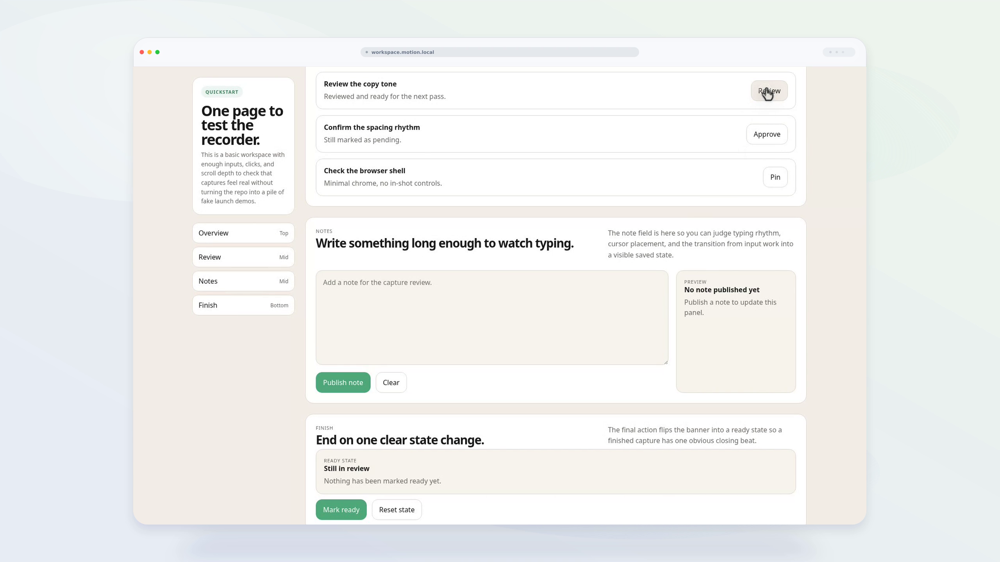

# Screenstage

Screenstage is a CLI for recording polished product videos from real web apps.

Point it at a local app, static page, or deployed URL and it will capture the browser, render a cleaner presentation shell around it, and export review-ready video artifacts like `final.mp4`, `poster.png`, and `manifest.json`.

It has two capture workflows:

- `run`: motion is preprogrammed in a demo module
- `record`: a human drives the browser live in the headed studio workflow

The output pipeline is the same either way. The difference is whether cursor and camera motion come from code or from a live session.

## What It Does

- records real browser sessions with Playwright
- renders polished browser demo videos with FFmpeg
- adds a synthetic cursor overlay for cleaner footage
- exports review artifacts like poster frames, contact sheets, markers, and manifests
- supports scripted capture and human-headed studio capture
- exposes a machine-readable CLI contract and a portable skill for agent use

## Quick Start

Install dependencies:

```bash
npm install
npx playwright install chromium
```

Build the CLI:

```bash
npm run build
```

Try the bundled example:

```bash
node dist/cli.js run ./examples/quickstart/screenstage.config.mjs
node dist/cli.js record ./examples/quickstart/screenstage.config.mjs
```

## Two Workflows

### Scripted Capture

Use `run` when the flow should be repeatable and the motion should be authored in code.

```bash
screenstage run ./demo-project/screenstage.config.mjs
```

### Live Studio Capture

Use `record` when a human should control the mouse live in the browser and Screenstage should render the same class of output artifacts from that session.

```bash
screenstage record ./demo-project/screenstage.config.mjs
```

## Sample Output

[](./docs/assets/quickstart-sample.mp4)

See the bundled quickstart render here: [quickstart-sample.mp4](./docs/assets/quickstart-sample.mp4)

## Agent Use

Screenstage also supports machine-facing execution:

```bash
screenstage run ./demo-project/screenstage.config.mjs --json
screenstage record ./demo-project/screenstage.config.mjs --json
screenstage init ./demo-project --yes
```

Useful overrides:

```bash
screenstage run ./demo-project/screenstage.config.mjs --json --output-dir ./tmp/screenstage
screenstage record ./demo-project/screenstage.config.mjs --json --visible
```

The CLI contract is documented in [docs/cli-contract.md](./docs/cli-contract.md).
The agent integration overview is in [docs/for-agents.md](./docs/for-agents.md).

## Portable Skill

This repo includes a portable Screenstage skill at [skills/screenstage/](./skills/screenstage/).

It is intentionally generic so it can be adapted to other skill-capable agent systems. Start with [skills/screenstage/SKILL.md](./skills/screenstage/SKILL.md).

## Docs

- [examples/quickstart/README.md](./examples/quickstart/README.md): bundled example
- [docs/config-reference.md](./docs/config-reference.md): config surface, presets, setup hooks, and record mode
- [docs/authoring.md](./docs/authoring.md): demo authoring, scenes, templates, and runtime helpers
- [docs/cli-contract.md](./docs/cli-contract.md): JSON events, manifest shape, and exit codes
- [docs/for-agents.md](./docs/for-agents.md): agent integration and positioning
- [RELEASING.md](./RELEASING.md): release process
- [CHANGELOG.md](./CHANGELOG.md): release history

## License

MIT. See [LICENSE](./LICENSE).
